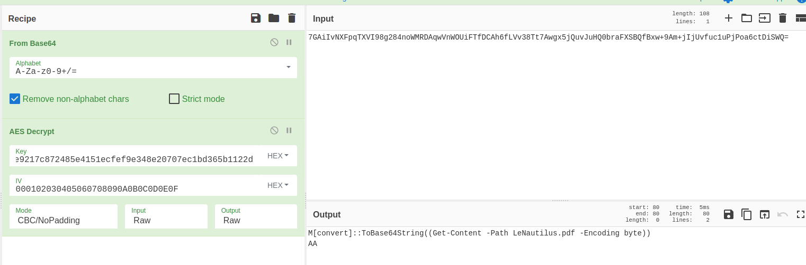

> # Extrême - Le Cracken
>
> Au milieu du café trône une table depuis laquelle un homme scrute ses semblables en engloutissant un breuvage étrange. Vous l'observez du coin de l'œil depuis plusieurs minutes déjà quand la porte du café s'ouvre avec fracas. Un homme surgit alors, criant comme si le café était tout à lui.
> « Capitaine ! »
> Vous comprenez immédiatement qu'il s'adresse à votre homme, qui aborde par ailleurs la plus belle casquette de marin qu'il vous ait été donné d'observer.
> « Du respect matelot ! rétorque-t-il. Ne troublez pas ainsi mes hôtes !
> — Mes excuses capitaine, ainsi qu'à ces messieurs et dames, mais je me dois de vous informer des évènements qui viennent de frapper le nautilus. Notre nouveau mousse a voulu profiter de notre rare escale pour utiliser internet, et je lui ai ouvert une session sur le système, mais cet inconscient s'est laissé attraper par un courriel agicheur et j'ai bien peur que le nautilus ait été compromis par un pirate !
> — Comment ! s'exclame alors le capitaine Némo, dont la barbe finement taillée contient à peine la colère qui rougit ses joues. Vous ne pouvez donc vous tenir cinq minutes ! Je suppose que vous avez pris les mesures adéquates ?
> — Bien sûr capitaine, j'ai pris soin de faire un dump de la machine affectée et ait entrepris de capturer le réseau passant par le routeur, nous devrions pouvoir investiguer l'affaire. Connaissez-vous quelqu'un qui pourrait mener l'analyse ? Commandez et j'irai à sa rencontre. »
> Vous même féru d'analyse forensique lors de vos temps perdus, vous marmonnez alors :
> « Je pourrais bien m'en charger, moi. »
> Némo vous entends, et ni une, ni deux, son regard vous fusille.
> « Attention, on ne parle pas en vain ici, vous allez vous y coller ! »
> Le matelot vous remet alors une clé USB...
>
> Analysez les données remises par le matelot et retrouvez précisément le document exfiltré par le Malware à son C2.
>
> Attention, ce challenge contient du code à visée malveillante. Bien que le concepteur ait fait de son mieux pour qu'ils soient inoffensifs, il vous appartient de prendre les précautions nécessaires à l'analyse des fichiers proposés.
> MD5 Cracken.7z : 28356457d3263a074dcc90846d766f07
>
> Auteur : Smyler#7078

I would like to thanks the author for this very interesting challenge ! I didn't complete it during the competition but the author help me a lot to solve it after the CTF ! **Big thanks to Smyler !**

## Here is your problem...

1. Let's begin with the memory, I bgun with simple things like cmdline and process, etc. Here is what I noticed :

```
# In cmdline
python /opt/vol3/vol.py -f WS02-20230524-025804.raw windows.cmdline
9960	7zFM.exe	"C:\Program Files\7-Zip\7zFM.exe" "C:\Users\Matelot\Downloads\Formation Grand Moussaillon.7z"

# In pstree
python /opt/vol3/vol.py -f WS02-20230524-025804.raw windows.pstree
*** 4016	2568	Formation Gran	0x8584daee1080	1	-	1	False	2023-05-24 02:53:14.000000 	N/A
**** 6524	4016	cmd.exe	0x8584da3e4080	1	-	1	False	2023-05-24 02:53:16.000000 	N/A
```

2. Now what happened is pretty obvious, the guy download a file named "Formation Grand Moussaillon.7z" and it's a malware (after some search we can see the file was obtained via outlook but it's not important for our chall), after I looked at the network capture and we notice a DNS exfiltration, the rest of the capture looks pretty legit

3. Let's get the malware : 

```
python /opt/vol3/vol.py -f WS02-20230524-025804.raw windows.filescan | grep -i 'moussaillon'
0x8584d57671a0.0\Users\Matelot\Downloads\Formation Grand Moussaillon.7z	216
0x8584d6504860	\Users\Matelot\Downloads\Formation Grand Moussaillon.7z	216
0x8584d89365d0	\Users\Matelot\Downloads\Formation Grand Moussaillon.exe	216
0x8584d95999d0	\Users\Matelot\Downloads\Formation Grand Moussaillon.exeGrand Moussaillon.exe	216
0x8584d95a3de0	\Users\Matelot\Downloads\Formation Grand Moussaillon.exe	216

python /opt/vol3/vol.py -f WS02-20230524-025804.raw windows.dumpfiles --virtaddr 0x8584d89365d0
Volatility 3 Framework 2.4.2
Progress:  100.00		PDB scanning finished                        
Cache	FileObject	FileName	Result

DataSectionObject	0x8584d89365d0	Formation Grand Moussaillon.exe	file.0x8584d89365d0.0x8584d8d22490.DataSectionObject.Formation Grand Moussaillon.exe.dat
ImageSectionObject	0x8584d89365d0	Formation Grand Moussaillon.exe	file.0x8584d89365d0.0x8584d88d6050.ImageSectionObject.Formation Grand Moussaillon.exe.img
```

## A little bit of reverse

1. I opened the malware in ghidra I also made a strings on it, we can see :

```
#Some interesting strings

cmd.exe

# We can see the address of the C2, usefull to search in the network capture
cxu5zdk80j3rtqqm1xk5nikxitq2ub.xyz

-----BEGIN PUBLIC KEY-----
MIIBIjANBgkqhkiG9w0BAQEFAAOCAQ8AMIIBCgKCAQEAuZ8N/aBBtJTT0zUKnQ6J
aXu3Pp6UZe2CyzmnyUrqIu5uTECT1UAJ7VMBno2nLS6ZMSvwKDzrk2j1THq+PvRA
rD4ykq7hvGLkuTXrUAFzDiWu6rIC9qzCuH0dUFszFN1uYqYgmCCjo46qzFbjV2DN
XPYLMys4euuqFN7M56vgjAbVwr/xbRBxUNdLmwd1wR8rsJf4DcKrm45VkQKXx8lO
gCUs45+tRJUQWIvOnHtiJtDP4OaeJE1pQ99B/1Z1vz7onU9AbKG0d0+bW7OW+BgM
OdIBKYEU0U9FTU73ZFr0SmWR+a+ksqkBwm7l/zIwrKhhfiX1YGF2+3Vl7CvvtK6e
0wIDAQAB
-----END PUBLIC KEY-----
DnsQuery_A
DNSAPI.dll
BCryptEncrypt
BCryptDecrypt
BCryptExportKey
BCryptImportKeyPair
```

2. In ghidra, I poke around (beginning by the **entry** function to get the **main**) In the main I entered all the function to find something interesting, I find a function with the C2 name in variable : 

```
# (This part give the C2 name)
  puVar1[1] = 0x386b647a;
  puVar1[2] = 0x72336a30;
  puVar1[3] = 0x6d717174;
  puVar1[4] = 0x356b7831;
  puVar1[5] = 0x786b696e;
  puVar1[6] = 0x32717469;
  puVar1[7] = 0x782e6275;
  *(undefined2 *)(puVar1 + 8) = 0x7a79;
```

3. After that I entered the next function call :

```
jsaipas((undefined (*) [16])local_88,(undefined (*) [16])local_118); # Yes I renamed it jsaispas cause i don't know what she do

# In this function we have another function call (the first one), I entered it cause this function use something call **BCRYPT_ALG_HANDLE** so I think it might create the AES object in this function :

aes_creation((BCRYPT_ALG_HANDLE *)(param_1[2] + 8));
```

4. In this function I find that :

```
  local_10 = DAT_7ff6ae02a068 ^ (ulonglong)auStackY_78;
  *(undefined4 *)(param_1 + 6) = 0x3020100;
  *(undefined4 *)((longlong)param_1 + 0x34) = 0x7060504;
  *(undefined4 *)(param_1 + 7) = 0xb0a0908;
  *(undefined4 *)((longlong)param_1 + 0x3c) = 0xf0e0d0c;
  NVar1 = BCryptOpenAlgorithmProvider(param_1,L"AES",(LPCWSTR)0x0,0);
```

5. I don't know what is the local_10 but just after we have the **IV** : **0x000102030405060708090A0B0C0D0E0F**

## Back to forensics :D
5. With some reverse we notice the binary is doing AES to do DNS exfiltration, he also do base32 for the request and Base64 for the response

6. Let's also extract the process to recover the aes key :

```
python /opt/vol3/vol.py -f WS02-20230524-025804.raw windows.memmap --dump --pid 4016

# Download findaes : https://sourceforge.net/projects/findaes/
# Compile to use it on linux : gcc -c main.c && gcc -c aes.c && gcc -Wall -W -O3 -D_FILE_OFFSET_BITS=64 -D_LARGEFILE_SOURCE -o findaes main.o aes.o

./findaes ../Finaux/pid.4016.dmp 
Searching ../Finaux/pid.4016.dmp
Found AES-256 key schedule at offset 0x4e4a0: 
6cbbf2a39fc7a2a64e9217c872485e4151ecfef9e348e20707ec1bd365b1122d 
Found AES-256 key schedule at offset 0x1374240: 
32c5ba3af02f53f04521988686424042b19ebb5cf41600ed6f66f6fe591fd87d
Found AES-256 key schedule at offset 0x13744d0: 
de99c83452a4217cc4e803bdb7565680cd23405ce770ec534d43e501ae7887f4 
Found AES-128 key schedule at offset 0x3a8d920: 
86122825412090c35185138b2076aefc 
Found AES-256 key schedule at offset 0x3b567e0: 
4abf8bfce3f4d7c7f82d00419d229ab083d883c92e2d5cc3d02ca4edcf06977d
Found AES-128 key schedule at offset 0x8f68dc0: 
e6b7dd82141c5d19b8f3e3f64c19c0ac
Found AES-128 key schedule at offset 0x600aecd0: 
84c8d66951fc0161e5ff4a50bfca5cb5 
```

7. We can take one of the encoded response in the capture and try the different keys :


8. I writed a script to get all the response : **extractdnsresponse.py**, to lower the amount of memory needed I filtered the packets on wireshark to get only the TXT response and I excluded a base64 strings, so my filter was : (I exclude this string cause I send nothing, only AAAA (something like that) this string is not a command but more like an ACK)

```
dns.txt != "NoF1V0qWBCmnnigicRIpDA==" 
# Should get 24 packets, file : only_dns_response.pcap
```

9. I saw all the command, what is interesting is the exfiltrated file which is also base64 encoded, I filtered my pcap to keep only the request, with this filter :

```
dns && ip.src==192.168.56.18 && dns.qry.type==16
# file : only_dns_request.pcap
```

10. I writed the script **extractdnsrequest.py** and execute it and redirect the result in a file to get all the exfiltrate data

11. I opened the result file with vi and deleted everything except the base64 string, then I delete all the line return and I have all my base64 encoded file in one file, I opened the file in icyberchef.com, transform from base64 and save the result to a file and I get the flag in the result file !
